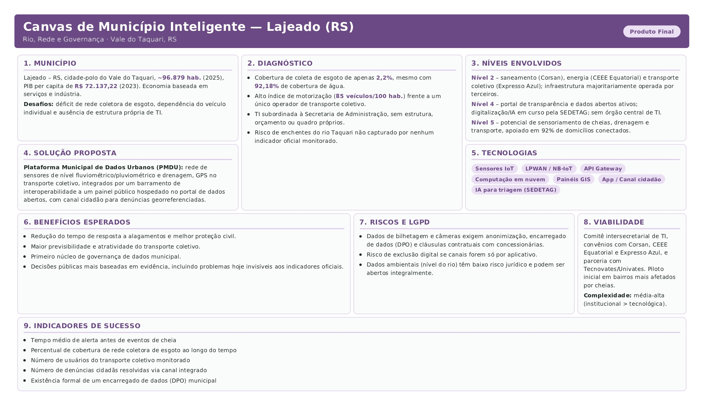

![][image1]

**UNIVATES – GRADUAÇÃO**

**Unidade de Aprendizagem:** CIDADES INTELIGENTES
**Professor:** Edson Moacir Ahlert
**Nome dos participantes:**
* Everton Luiz de Oliveira
* Kauan Morinel Calheiro
* Larissa Alissa Träsel
* Samantha Danieli Gerhardt

**Data:** 14/08/2026

**Município escolhido:** Lajeado – RS

---

# Planejamento de Soluções para Cidades Inteligentes
## Planejando um Município Inteligente, Humano e Sustentável

Referência obrigatória: CNM. *Municípios Inteligentes, Humanos e Sustentáveis*. Brasília: Confederação Nacional de Municípios, 2021. Disponível em: https://cnm.org.br/biblioteca/exibe/15039

---

## 1 – Os cinco níveis de um Município Inteligente

**Cidade alvo da proposta de integração técnica: Lajeado – RS**, cidade-polo do Vale do Taquari: aproximadamente 96.879 habitantes (IBGE, 2025), 1.026,47 hab/km², 99,67% de urbanização. A proposta articula os Níveis 2 (infraestrutura, serviços e redes), 4 (serviços e TI) e 5 (IoT) do modelo CNM (2021).

### 1.1 Diagnóstico da infraestrutura existente (Nível 2)

A ficha-retrato mostra infraestrutura desigual entre serviços:

- **Saneamento (crítico):** água em 92,18% dos domicílios, mas coleta de esgoto em 2,2% (2022), com 87,2% do coletado tratado. O gargalo é a rede coletora, e não o tratamento. A rede é operada pela Corsan sob fiscalização da Agergs, fora da governança municipal.
- **Energia:** distribuição com a CEEE Equatorial (privatizada em 2021); a iluminação pública fica com a Prefeitura, de modo que o dado de consumo é da concessionária e o de manutenção é do município.
- **Mobilidade:** 82.357 veículos para 96.879 habitantes (85/100 hab.) e um único operador de transporte coletivo (Expresso Azul S/A, bilhetagem "Tio Lajeado"), sem alternativa modal.
- **Conectividade digital:** 92,09% dos domicílios com acesso à internet (2022), patamar favorável à implantação de serviços digitais e sensoriamento urbano.
- **Resíduos:** coleta em 100% do município, com seletiva ativa, por duas terceirizadas (Coleturb e GLV) sob gestão da SEMA.

O traço estrutural do Nível 2 é que a infraestrutura crítica (água/esgoto, energia, transporte) é operada por concessionárias, e não pela Prefeitura, o que antecipa o principal desafio: governar dados que não nascem no município.

### 1.2 Situação atual dos serviços públicos digitais e sistemas de informação municipal (Nível 4)

**Lajeado não possui secretaria, autarquia ou empresa própria de TI**: a área é um setor interno da SEAD, sem orçamento, quadro próprio ou autonomia, apesar do orçamento municipal de R$ 767 milhões (2025). A pauta de inovação corre diluída na SEDETAG e no Conselho de Ciência, Tecnologia e Inovação.

Ainda assim, o município apresenta ativos digitais relevantes para o Nível 4:

- Portal de transparência e portal de dados abertos ativos (grp.lajeado.rs.gov.br);
- Sistema e-SIC para pedidos de informação, tanto do Executivo quanto do Legislativo;
- Digitalização das secretarias e IA em tarefas administrativas, pela SEDETAG desde 2025;
- Tecnovates/Univates como possível parceiro técnico do setor público.

Esses ativos crescem sem órgão central de governança: o Nível 4 avança em iniciativas pontuais, mas sem a espinha dorsal institucional que sustenta a integração entre secretarias.

### 1.3 Potencial de aplicação de Internet das Coisas (Nível 5)

Cruzando a Leitura Crítica (Etapa 4) com os 92% de domicílios conectados, três frentes de IoT se destacam:

1. **Cheias do Taquari:** sensores fluviométricos e pluviômetros em tempo real ligados à Defesa Civil, resposta ao ponto cego da Etapa 4.2, já que nenhum indicador oficial capta o risco de enchente apesar das cheias de 2023 e 2024.
2. **Saneamento:** sensores de vazão e qualidade na rede da Corsan e de nível em pontos críticos de drenagem, compensando os 2,2% de rede coletora com monitoramento preventivo de transbordamentos.
3. **Mobilidade:** GPS embarcado e contagem de passageiros no "Tio Lajeado", alimentando painel público em tempo real, resposta aos 85 veículos/100 habitantes.

### 1.4 Proposta de integração entre os três níveis

A proposta é a criação de uma **Plataforma Municipal de Dados Urbanos (PMDU)**, hospedada em nuvem, com a seguinte arquitetura lógica:

- **Coleta (Nível 5):** sensores fluviométricos, pluviométricos e de drenagem, GPS do transporte e medidores inteligentes, via LPWAN/NB-IoT.
- **Integração (dos Níveis 2 para o 4):** API Gateway que recebe dados das concessionárias (Corsan, CEEE Equatorial, Expresso Azul) por cláusula contratual e os publica em formato aberto, compatível com o portal existente.
- **Aplicação (Nível 4):** painéis públicos (transporte, alertas de risco, qualidade da água) no portal de transparência e módulo de alerta automático para Defesa Civil e SEPLAN.

A integração exige formalizar uma governança mínima de TI, ao menos um comitê intersecretarial, já que hoje a TI não tem mandato, orçamento nem equipe. A sustentabilidade econômica vem de sensores de baixo custo, reaproveitamento da conectividade instalada e parceria com a Tecnovates/Univates para desenvolvimento e pilotos, em vez de um investimento único concentrado.

### 1.5 Privacidade e proteção de dados pessoais (LGPD)

Como o transporte coletivo (bilhetagem "Tio Lajeado") e eventuais câmeras de monitoramento de trânsito envolvem dados pessoais (geolocalização, hábitos de deslocamento, imagem), a plataforma precisa observar a LGPD desde a concepção (*privacy by design*):

- Anonimização e agregação dos dados de deslocamento antes da publicação em painéis públicos;
- Definição de um Encarregado (DPO) municipal, hoje inexistente;
- Contratos com as concessionárias (Corsan, CEEE Equatorial, Expresso Azul) prevendo cláusulas específicas de compartilhamento de dados, finalidade de uso e prazo de retenção;
- Dados ambientais (nível do rio, qualidade da água) não são pessoais e podem ser publicados em tempo real, o que os torna o ponto de partida de menor risco jurídico.

### 1.6 Participação cidadã e impacto esperado

Um canal cidadão integrado ao portal permite reportar falhas de infraestrutura (buracos, vazamentos, alagamentos), complementando os sensores fixos com dado georreferenciado da população, o que é relevante porque a Leitura Crítica mostrou que a experiência vivida não aparece nos indicadores oficiais. Impacto esperado: menor tempo de resposta a alagamentos, transporte mais previsível e um primeiro passo de governança de dados.

---

## 2 – Dimensão humana e sustentabilidade em projetos inteligentes

### a) Dois exemplos reais aplicáveis a Lajeado

**Exemplo 1 – Digitalização das secretarias (SEDETAG, desde 2025).** Em vez de investir isoladamente em sensores, o município prioriza reduzir burocracia e tempo de atendimento. É tecnologia como meio para melhorar o serviço, e não como fim, que é a essência da dimensão humana no modelo CNM.

**Exemplo 2 – Tecnovates (Univates).** Uma incubadora ligada a uma universidade da própria cidade ilustra o capital humano e a sustentabilidade econômica do modelo: soluções podem nascer localmente, com menor custo, mais aderência ao Vale do Taquari e emprego qualificado no município, reduzindo a dependência de fornecedores externos.

### b) Decisões técnicas de Engenharia e Tecnologia e desigualdades sociais

Decisões técnicas podem tanto reduzir quanto aprofundar desigualdades, a depender de como são desenhadas:

- **Pode reduzir:** eleger a rede coletora de esgoto (2,2%) como primeiro alvo atinge quem tem menor capacidade de arcar com soluções individuais (fossas, poços). Da mesma forma, concentrar sensores nos bairros historicamente atingidos pelas cheias, em vez de distribuí-los uniformemente, direciona o benefício a quem mais precisa.
- **Pode aprofundar:** se a plataforma depender só de aplicativo, a exclusão residual dos 92% conectados recai sobre os mais pobres e os idosos. E priorizar sensoriamento voltado ao automóvel (semáforos e estacionamento inteligentes) sem contrapartida no transporte coletivo beneficia quem já tem carro, reforçando a desigualdade de acesso apontada na Leitura Crítica.

O ponto central é que a tecnologia não é neutra: a escolha de onde instalar o primeiro sensor, de qual canal usar para coletar denúncias, ou de qual serviço digitalizar primeiro é, também, uma escolha política sobre quem se beneficia primeiro.

### c) Participação cidadã na concepção, implantação e avaliação de soluções

A participação cidadã é o que diferencia uma cidade *inteligente* de uma cidade apenas *instrumentada*. Em Lajeado isso é evidente: a Leitura Crítica encontrou uma lacuna entre o retrato estatístico e a experiência vivida: o risco de enchente não aparece em nenhum indicador oficial, mas é reconhecido pelos moradores. Daí que:

- **Concepção:** a escuta prioriza corretamente os investimentos, apontando bairros alagáveis sem indicador oficial correspondente;
- **Implantação:** evita desperdício em soluções tecnicamente corretas mas socialmente inadequadas, como um aplicativo que a população não usa;
- **Avaliação:** a percepção da população contrapõe os indicadores técnicos, já que um serviço pode estar "funcionando" nos números da prefeitura e não corresponder à experiência de quem vive na cidade.

---

## 3 – Produto Final – Canvas de Município Inteligente

---

## Fontes e uso de inteligência artificial

A base fundamental deste trabalho é o documento entregue pelo grupo na aula anterior, onde constam os links e as fontes oficiais consultadas para cada indicador. Todos os dados, atores e iniciativas citados aqui vêm desse levantamento, complementado pelo documento base da atividade.

O grupo utilizou o **Claude (Anthropic)** como ferramenta de apoio, em duas frentes: revisão e organização do texto, e montagem do canvas de município inteligente a partir do conteúdo produzido pelo grupo. As decisões de conteúdo, a escolha dos problemas priorizados e a conferência das informações nas fontes oficiais foram feitas pelos integrantes.

##

[image1]: <data:image/png;base64,iVBORw0KGgoAAAANSUhEUgAAAYUAAABUCAYAAABtNit2AAAWb0lEQVR4Xu3dd9wV5ZXAcddEY0s0khg1aoxZN5rVGHVTjJs1rrFgA0VF7KiERZNgixXF3hUsFCnSiwpI7wGUjoAUBamvgIA0UdpLlXwOZtjhN3Om3blzy3v++Bozc855nvsKc95778zz7LVz5869SsnaDZsPqf7guwP3OvflnW43vTCkHWONMcbE4zlQrFavq6z2i1s7fMxmQDUa9+m94+udezPfGGNMOM+BYjJwUkX1fau/soUX/qiOvLrVUtY0xhij8xwoBr3Hza/x7QuabuNFPqnDrmy5Yu5na4/nOMYYY/bkOVBIb78398q9z2uygxf1tFSr1WL1rEVrTuS4xhhjvuE5kLWGzUc25cU7K60GzqzH+RhjTFXmOZCV+k2Ht+RFulCa95vegPMzxpiqyHMgn06q13EmL8jF5vrnBnXkvI0xpqrwHEjbirWbDvt53Xaf8OJb7Go/OaA7X4sxxpQ7z4G07HNB06280JaqZ7t/cB9fnzHGlCPPgTT8oFaLVbywlroX35l8N1+nMcaUG88BzY/rtPpMLo487mf/i17dxItqqXuiy4RGfJ3GGFNuPAf8yLIRzsXxs9Xrf8zzxhhjyoPngJ+ajfu+6zSFxSvXH83zxhhjyoPnAH29c+e/uT9GKZamMPGT5b+RL4Cb9prakOeMMcYk4zlAVz3Z/61iagqv95l2Oz/vF9+58JXNjDXGGBOP5wDx4luIpjBq+pKzOI8wy9ZsOIJ1jDHGBPMccJOne3mxzbIpyANkHD+uJavWH8W6xhhTyuRj/Ttbjnr55D93nOG+3h19TevFFzzQa9CnK9b9hDlReQ7scdLnIptFU6j1eL8eHDdXD7cf9zjHMcaYUvJQu7FP8toWRFadjvuLsefAHid9BonSFLZs27GvxMr/8pzGeQ4iC7JEN8cvNM6RNm3Ztj9z8o1zEIzR4sRRdVovYWxWVn1V+QPOJ+78KWnejIpVJzM3nzi+GDL50/MY59Zz9LzLmSN7mjAuCtYpNM6vkHPkPKKQ/3ask8QZDbuNY20/ngOOlv1n1GdREaUp/O5v3cZLbJ9xCy7lOTr8qjeWc4ysnHNvj+Gcjx8nvvuoObV5Li2cm5+Nm7cdwLx84viCMVqcQ24MYHwWBk/+9HzOJcn8g3Lj7P3B3HzZULntQI4dZXzGR83zwxqFxvkVco5xn/PKx+oQw6Yu+hPHcfMc2H3Cp5gIawqVW7fv58RqTUG2yWTdQuMc3aLG5YLz0TAvnzi2Nj5jSC6ezMm3LJqC+6HOMMzNF44bZfyXe065k/GO425ou4DxYVij0Di/Qs4xalOYWbH6JOam6T/qtpvDMXf/bHhAtBvy8U0s4ghrCn+48633nVitKbBmMeActfnyXFo4Hw3z8olja+Mzxk+zvtNuY14+ZdEU4uQ+1XXig8xN26KV647huOKBtmOeZqwb44nxYZhfaJxfIecYpSnIM1jM8/Ot85tsly+b123a+l0nt//EhRed2qDzVMb6OfTy5ms49q6fDQ/sOuhTwBHWFNyxWlMoNe7XdO59PYfyfBr4c9Zs2/H1t5mbLxxbMEaL85PlO4asmsL/3PX2e4zTMDdtHC/quIyng2s2+5I5QZhfaJxfIecYpSkwhxp3HP8oc/zItWLf6q9sYb7bdc8O6sQ8T6FdB32SHVW9KQieTwPH0MhnxszNF46tvXbGBMmqMWTVFOQvHuM0stsg89MybtayMziekO8GGesmuw4yxw/zgjC30Di/Qs5R9pfhXNwOuPi1jcxxO+Hm9rOZE4Y1qOLzr47dI54F5n629ngmuQU1hfvajH7WHVuuTSEfr4tjaEq9KYiwC1UasmoKQp6mZ6yGuWnR5sA4YrymRuM+vZmr+f5lzb+QHPl446y73x4lS9GMmLbk7NXrKqsxNu48Lm7Uux9zxfCpi8+RZW/k42uu0szYOOOdeEv7WcwluTNw6vyVpw6cVFFdvp+R66A8Y8U7KsPu5uo9bn4Nju8W9x2bQ25JZS1yx3sKMJiCmgJj83HxLAS+LsGYXLG+phyagsj3O4Ysm0JaNXLBcYRcpBjndn/b0c8wJwjz08SxNFpTiIt1NVGaQlo4NjE+jgmzl/+W9dz+dF+PYU7sHonyNoLBpDWFRu3HPsFYawrRsb6mXJqCyOc7hmJtCg2bj2zK3Fx9OH/lrzhO2HwF48MwP00cS1NVm8LT3SY9wPi4WJN2x8VJElpTYJwo5qbAH0QQvi6R9hadrK8pp6Yg8vWOIeumcMXj/d5hvIa5uWJ9EfZzrfP0wK7MCSNfWrJOWjiWplybwnNvfXAvx3ZjfBKsSbvjnH+Rb8UZ5MevKTzWafwjjBPl3BSi5kbF2ppyawqi9cCZt7JmrrJuCnHqyP4kzE1K+xy615h5lzHWjfFRbd2+Yx/WSgPH0ZRrU/jPWzt8xLHdGJ8Ea7r9951vjd4dFyXBza8pMMZRCk3hV//X6UOeI74uh3ypxNikWFuzvnLrQczNF44tGKPFxSVfSrJuLgrRFO5q+d5LzNHIQ57MT4J1hXzRyjhiThyslQaOoSnXpsBx6Y0BM/7MnLhYUxxzbetFXI4oMMFPuTUFwXPE1xUnNyrW1ZRrUxBpNoZCNIU4tU5r0HkKc5NgXTF57orTGedW98UhbzInDtZLA8fQVNWmEHbnUlSy7pv83ZC1wXjO8f//4jMRP2wKso4GYxyl0hRaDZxZj+e1WPpy45aDGZ8E62rKuSmItD5KKlRTkOUDmKdhblxxXqMb40WcdZy27/j6W6yZK46hqapNQcizKMzLh13/2O+iVys5AQ2bAs+7lUpTEDwfFEuMT4I1NeXeFEQa7xjiXDAZo2GehnmaXD+fZz0R9mWwLALJHCEXeh4Lwrq5Yn1NuTaFY69rU8Gx/fzi1g4fMzdt3/zDZ3CNuymE7YhmTSE61tSUUlOo12RYKx6L6s3BH9XlOHGUQlP4fcPuY5kblby7ZT0x5qOlZzLWjfHC+Q5Cu2HET1rvkB2srynXpnBv69HPcWzNSfU6zmR+mvaKuniSw90UeI5KqSkE3T/OWJq+cNUvmRMXa2pKqSnIuVteGtqGx6PK5R1DIZuC3K7MXE3QU75BWEdUq9ViNePcZLcu5oiwuhrWzwVra8q1KQiOHcXlj/XryTq5ij2Rcm0KgjFBsW7yWD9z4mJNTak1BVGIxlDIphCn5k+ubfMpc8Nou2+FbcF4UaN3+zNHuGOCVkgmWRKHYyTF2hprCrrLHu3bS5ZzZ924Yk+knJvCPa3ef4FxWizNXvzFCcyLg/U0pdgURNaNodBNodvIT65mvoa5YZgvwj5rlg2amCOufmpAN8bKnS6M0zA3KdbVlHNTSGuHNTdpFBwnTOQfjqOcm4JgXFCs2w+vaLGSeXGwnqZUm4LIsjEUuinEqfvVxi3fY24Q5ouwPxfc4N3BOCGL1zFOw9ykWFdTzk1B/NftXT7gHNIybcGqUzien9jbvZV7U5i/7MufRY0l5sXBWpqwv/xp4tjaa2RMUOzNLw1ty7io5KMN1tOUUlMI2gWLnugyoRHzo8yN8UL+7jMuKN6PbOzD3CRYV5N1U5ClrH/9l66TTqnfaZo8dfzzuu0++dkNb86Xj/2OqP3GMvll8LuXvr6OeSQxnIOGuWmTVVw55h7jy0WGSUHcTSFoGz9Rik1BxIl1y2UDHNbSlHpTELk0hqjvGIqhKcT5fN7vlxE/zBNykWKc2+at27/DHME4N/k5M17D3CRYU5N1U0gT5xBElhtnftrkNliOK2L/gMr1OQW3OLFuFz707gDmRsVamnJoCiLfjaEYmkKc2lFuVtBu8V27YfMhjHWT33SZE/YdxICJFRcyRzP242W/Z35crKmpKk0hq3n63Ra96x/yh4rBGjaFoNvvSrUp9B2/4JKosZT023/W0WTVFLQvJhknGBMU65bPxlAsTeEfHy7+X9bRjJy+5I/Md2O8kE1sGOf2+dqNP2KOYJyfgy59bT3zNMyNi/U0Va0pOGQbYNZL0xfrN3/fGWv3oAzSsCkE5ZZqU+A6IzwfJOkKmKyjyaopaKvmMk4wJiiWbnphSDvmRcX/Tm7F0hTi1A96PVqdsCUnuPuXg3F+ZlasPol5GubGxXqaqtoUHJPmfP5r1k2LM8buwbTt/KgqNAXh/q2N58JwrChYQyNb6zE3H7Q/fIwTjAmK9XPj84PbMzcq7UJaTE0hbIvbKGPIVoyMDYoX2uY7593fc8jzb3/w98c7T3j4gbZjnr79tRGvy7s2eYBT/r8cf7X3h39tM2jmLczVSD7Hj4P1NFk3BXnaWx7w5ZfM0mzlS2b52I/bf/qRd12cQxpkiXSOlVT3UXNqS83dxYMWtnPzawqXPNy7L+NEKTeF3/yl68SoscSxomANjewFy9x80D5TZpxgTFCsJu3GUExNIc4Y42ct/x1ztfzf/rXbBMa5hW0CnzaOHwdrabJuClnfkpqL5v2mN+D845I6exRlgB+/pqAtplXKTWGfC5pujRpLC5Z/eRzHC8MamqFTFp3L3Hx4ssvEhzi2YJxgTFBskDQbQ6k2BXnHztwajfv0ZpzgOvjE+Hx7d+z8mpxDVKylsaYQTn5x5OuISpbU3qNYvwkLL2YQ+TUFcf4DvQYztpSbgvsPH8+F4VhRsIbm763ef565+XBGw27jOLb22hgTFBsmrcZQbE1hRsWqk1lP89Z7c65y8jZt2bY/z4srn+j/NsdwkyfsmZMFziMq1tFYU4gn7hfUR9VpvcRThEGkNQVZBpixpdwU5IvWqLHEsaJgDY088cjcfOC4Qa+NMUGxUaTRGIqtKQjWC+LkyM6APBdlLt+r8fpXzMkC5xEV62isKcQntx/zdQVigR6j59XyBLloTUGcfc87I9yxpdoUDr/qjeVRY+mprhMf5FhRsE4Q5uYDxxR+6+RosbnO84bnB3dgvaikMRRjU9j11tynrh8nh8fF3W+89yJru+VjDZ2oZNE9zicK1tFYU0hmyrwVp/G1qZgsPEEuQU2BT06WalOYt3Ttv0eNJY4TFesEYW7atCWW2w/9+EbGCsalNc/rnh3UiTVzxTEEYzTMS4I1NfJ3x+/dd5R5xHkaOR84nyhYQ2NNITm+NhUTw5KDmgJzS7UpxIl1e6TDuMeYGxVrBWnSc+odzE+Ttocv4xyMC4uPQx4GZN1csL5gjIZ5Sci7UNaNizWJ8WHky2255TXqbelhZPE9zikMa2jKuSkMnFRRXTbQ4RzS2tBIbkVmbV9MFH9rNvIVT+C/hDWFQ2o2W+vEVrWmwLw45P5n1gvC/DRxrLAxGRcWH1ea7xhYWzBGw7wklq7ecCTrxiHPFLCm2/szP/sDcwTjkpALJOtqmBuG+ZpybQqn39ZlMsd2HHp58zWMTyLKjUS7MNHhCfyXsKbgfmCmFJuC30ckjNEwL45BH1RcwHpBmJ8mjhU2JuPC4pNIqzGwrmCMhnlJsW4crEVyKzVzouRFEWfxzAffHPMU84MwX1OOTUH2ceG4xJwkZBMm1vXFREf9psNbeoLPDW8KwllKthSbAuOCYt3+eM87I5kXF2sGkRsCmJ8G2fidY4kfXdXyc8Y6GOtgXK6ufWZQZ44RF2sKxmiYl5R2m2kYeQqZtdw6DZ99HXOEfPHM2KT8bj3XMDcIczXl2BQ4ph/mJCHPOLEu/fT6tgs9iW5MEFGawuS5K06X2IXLv/opzxULvi7ReuDMWxmnxZJ8yc68uOQZBNYNwvw0cAzHqOlLzmJsWA7j0pBrY2A9wRgN83IRZ3ezqOMzPmpeHHG+42FuEOZqrCkkd3/b0c+wLu26c42JbkwQUZpCKeDrEowJinWTB72YkxRrh2F+LmTTENYXQe8SBOPzMTe3OBcmYi3BGA3zcsX6YZjvpj2Bnus2sX44hkYehGKuhrmacmwKUR40ZE4SrEl7n9dkx644Jrr5fbFUrk2hWd9ptzFGi6UNldsOZE5Sx93QdgHrh2GNJBq8+o/mrOsIW5mV8WnOS1Pn6YFdOV4UrCMYo2Ferlg/yGOdxj/C/Ci1GJcGWa6b42iYq2GephybgtC+C3LI30/mxMWa5CwC6kkkJpZrU+D5oFhifK7OubfHcI4RRlZLZJ2ogu58kO8YGE/McTAubdqaW0FYQzBGw7xcRb5FMMLYjBdr1lUeyri0cCyNLMrHXD/M0xRjU5DnSWQZE3lgUnZMk+0uaz85oDuXLef6XMSxKelrj/r3ZPc8WIB4q6Q1hT0deMlrGxifBvnIhmOFkT+IrBOk47BZ17MGMccPc+Lk5iruOwbmC8ZomJerqB+D+d0R5/ZSjyl3MScf83W7/rlBHTmehrl+mKNJemEk1s3KirWbDuNcHHLrKeNJniFiXhjW8DN94apf7o5nAVq2ZsMR7uRybApyYeF5LZbGfLT0TManhWNFdfxN7ea27D+jvt++v/Ll/2WP9u3FHD98slvDPAfj8kWW3+DYGuYKxmiYlwb5pYLjEHOI8VHzcsXxNMzzwxxNqTcF95pqfhjvp8OwWTcwT+PcCRqEH015ivg5+prWi50CQU2BgxUDztFvrjxHrOnY76JXKxmbNrkNkeNmQbZx5Fw0zHUwLp/ivkV2Y4yGeWnhOG4jpi05m/Fu2oOmcf77JdWo/dgnOK4fWZyPucQcTbk3hbhzkzsWV6+rrObkyvNO8kQ54zR+34d6JuRn0cp1xzhFgprCCTe3n81BC41zdDjnr3i83zs8R6zpkP13GZsPaWyeEdUx17ZexPHDsIaDcfkW5R0DcwRjNMxLC8eJMybjo+alheNqmEeM11SFppDV/O5sOUr+w3jH5gGNU4jH/fAjp6y1GjizHudETiyP+2F94d6EJ0unNeg8hXNJQ+OO4x/lWFGxloNxWQh7x8B4wRgN89KiPa0tC9sxlpgj0nhmJiqOrcn1S1ZHVWkKQluYMld+Gzm5eQ6kSb5U4YTyaePmbQdwDhonh8f9cBwh21UyLkvy7uHIq1st5bziOKV+p2lp7OTGukKaF+OyIl+4cz4OxgrGaJiXJo4lZIE0xrlVbt2+H3PyPU+K88Alc90Yqwm7NTcq1s0K5xFFkrsRNX3HL7iE9clzIJ/S3jO2Wq0Wq2ctWnMix0kbxxWMMcaYfJLtV4N+4dG83mfa7awVxHMgCwdd+tp6TjyOH17RYiVr5hPHF4wxxpisyMeksj7dqQ06T3Vfl+RjbdmCU56ZYE5UngNZ0hbd03BHtKxwHrKGCGOMMaYceA4Uypl3dB/Di6+Q7f2kKzI+S5wTzxtjTLnwHCg0ebJOfhPvMmL2NTxXKO6GcEeLUU143hhjyoXngPGydwnGmKrCc8B4WVMwxlQVngNB+Nl6OeBr9OOsdhjnwRNjjClFngNBeEEtB3yNxhhTlXkOBJFVN3lRLWX2pbExxuzJcyAqWVKCF9liJ9vNdR3xSR2+FmOMMd/wHIhL1l+Riy0vwMVEFhbrMXpeLc7dGGPMnjwHcpXrIm1pOfa6NhVLVq0/ivMzxhij8xxIi6zLzwt1FmT70OVfbDyc8zHGGBPOcyAfkqzsF4fsF8sxjTHGxOc5kE83Pj+4PS/oubjlpaFtOIYxxpjkPAeyIBdzXuDjkNVVWdMYY0zuPAey9ubgj+ryou+n47BZ1zPXGGNMujwHCqX7qDm1D6nZbK27ERxcs9mX9lyBMcZk558K3GUyczWShQAAAABJRU5ErkJggg==>
