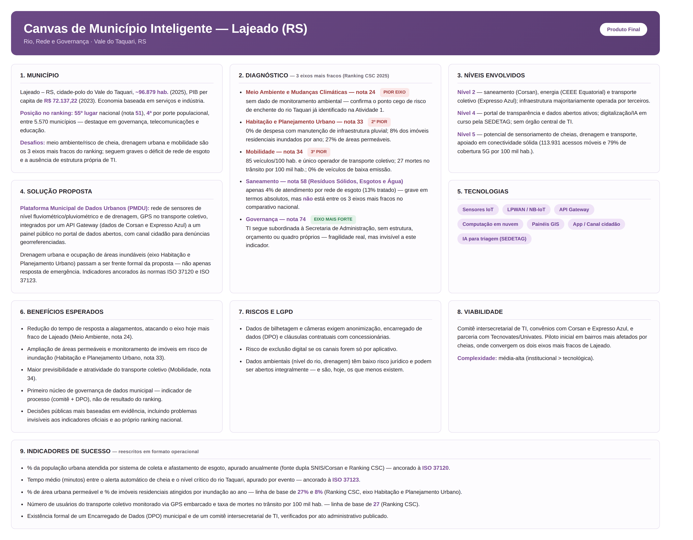

![][image1]

**UNIVATES – GRADUAÇÃO**

**Unidade de Aprendizagem:** CIDADES INTELIGENTES
**Professor:** Edson Moacir Ahlert
**Nome dos participantes:**

- Everton Luiz de Oliveira
- Kauan Morinel Calheiro
- Larissa Alissa Träsel
- Samantha Danieli Gerhardt

**Data:** 21/08/2026
**Município escolhido:** Lajeado – RS

---

# Como se Mede uma Cidade Inteligente
 
## Indicadores, rankings e revisão do Canvas
 
Este documento dá sequência às Atividades 1 (Ficha-retrato e Mapa de Atores) e 2 (Planejamento de Soluções e Canvas de Município Inteligente), submetendo a cidade de Lajeado RS e a proposta da Plataforma Municipal de Dados Urbanos (PMDU) a um exame externo: os instrumentos consolidados de medição de cidades inteligentes o curso Cidades Inteligentes (EV.G/Enap, 2021) e o Ranking Connected Smart Cities (CSC).
 
> **Observação.** O material do curso EV.G/Enap foi publicado em 2021. Entre 2021 e 2025, a metodologia do principal ranking brasileiro de cidades inteligentes mudou de forma estrutural de um recorte amostral de pouco mais de 700 municípios para a totalidade dos municípios brasileiros, e de uma base de ponderação própria para uma base majoritariamente ancorada em normas ISO/ABNT. Essa mudança é tratada em detalhe na Etapa 1.
 
---
 
## Etapa 1 — Ficha de confronto
 
| Afirmação do material (com módulo) | Situação verificada hoje | Fonte primária (órgão, título, ano, link, data de acesso) | Consequência para o projeto |
|---|---|---|---|
| **[Obrigatória — Módulo 3]** O material descreve o principal ranking brasileiro de cidades inteligentes como um estudo que avalia cerca de 700 municípios, tendo o Índice Firjan como uma de suas referências de base. | **Superada, e mais precisa do que uma verificação por fonte secundária permitiria.** O Ranking Connected Smart Cities (CSC), da Urban Systems/Necta, de fato analisava "mais de 700 municípios brasileiros" nas edições de 2016–2017, mas sua ponderação nunca foi o Índice Firjan sempre foi um índice próprio da Urban Systems (Índice de Qualidade Mercadológica). Na 11ª edição (2025), o ranking passou a cobrir **todos os 5.570 municípios brasileiros**, com **75 indicadores em 13 eixos temáticos**, 59 dos quais (78,7%) vinculados às normas ISO/ABNT 37120, 37122, 37123 e 37125. A consulta direta à ficha de Lajeado na plataforma confirma esse desenho e revela um detalhe que a fonte secundária não mostrava: o **IFDM (Índice Firjan de Desenvolvimento Municipal) não desapareceu — ele continua presente, mas apenas como 1 dos 75 indicadores**, dentro do eixo Governança, e não como a metodologia estruturante do ranking. | Plataforma oficial de consulta por município (Scipopulis/SPIn/Urban Systems). *Ficha de Lajeado – RS*. https://ranking.mysmartcity.scipopulis.com/ranking/city/4838. (prints capturados pelo grupo). Complementado por: Portal Connected Smart Cities, *Ranking Connected Smart Cities inicia novo ciclo com abrangência nacional e metodologia ampliada*, set. 2025, https://portal.connectedsmartcities.com.br/2025/09/23/ranking-connected-smart-cities-inicia-novo-ciclo-com-abrangencia-nacional-e-metodologia-ampliada/. | A afirmação do material de 2021 estava desatualizada em dois pontos, agora corrigidos com dado primário direto da ficha do próprio município: (i) a base amostral não é mais restrita (~700 → 5.570 municípios), então a posição de Lajeado é comparável à totalidade do país; (ii) o IFDM sobrevive no desenho atual, mas como componente marginal (1/75 indicadores) de um único eixo, não como fundamento do ranking — o que reforça a leitura de que ancorar os indicadores do Canvas em normas ISO/ABNT (Etapa 3.2) é mais robusto do que ancorá-los no IFDM. |
| **[Livre escolha — Módulo 3]** O material cita as normas ISO 37120 e ISO 37122 como arcabouço de indicadores para cidades inteligentes e sustentáveis, no estado em que se encontravam em 2021. | **Vigente, com a família de normas ampliada.** A ABNT NBR ISO 37120:2018 e a ABNT NBR ISO 37122:2020 seguem vigentes. Desde 2021, a família cresceu: a ABNT NBR ISO 37123:2021 (cidades resilientes) foi publicada, existe um documento de orientação sobre o uso conjunto das três (ISO/AWI 37124), e uma norma mais recente (ISO 37125) já é referência de indicadores do Ranking CSC 2025. A ficha de Lajeado confirma isso na prática: a grande maioria dos 75 indicadores exibidos traz o selo "ABNT ISO" ao lado do nome — por exemplo, os indicadores de perdas por desastre e de fundo de reserva para desastres (eixo Economia/Finanças) já refletem a lógica de resiliência da ISO 37123, não apenas a ISO 37120/37122 citadas no material de 2021. | ABNT Certificadora. *Certificação de Indicadores para Cidades e Comunidades Sustentáveis*. https://abnt.org.br/certificacao/smartcities/. Confirmado empiricamente pela ficha de Lajeado: https://ranking.mysmartcity.scipopulis.com/ranking/city/4838. | Reforça a decisão de reescrever os indicadores de sucesso do Canvas ancorados nas normas ISO 37120/37122/37123 (Etapa 3.2): não é uma escolha arbitrária do grupo, é a mesma lógica que já estrutura os 75 indicadores oficiais do ranking em que Lajeado é avaliada. |
 
---
 
## Etapa 2 — Posicionamento da cidade e crítica dos indicadores
 
### 2.1 Onde a cidade aparece
 
Fonte primária consultada diretamente pelo grupo: ficha de Lajeado na plataforma oficial de consulta por município do Ranking Connected Smart Cities - https://ranking.mysmartcity.scipopulis.com/ranking/city/4838, ano-base 2025.
 
| Item | Valor |
|---|---|
| Posição geral no ranking | **55º lugar** (nacional, entre os 5.570 municípios brasileiros) |
| Nota geral do ranking | **51** (a imprensa local, em fonte secundária, havia divulgado 50,86 - a plataforma exibe o valor arredondado; ambos os valores são registrados aqui, sem escolher silenciosamente um deles) |
| Posição na região | **20ª** - a plataforma não especifica no rótulo exibido se o recorte é a Região Sul ou o Rio Grande do Sul; o grupo registra o número exato e a ambiguidade do rótulo, e recomenda confirmar o recorte exato na documentação metodológica do ranking antes da versão final |
| Posição por porte (faixa populacional) | **4ª** - Lajeado está entre os quatro municípios mais bem colocados de sua faixa populacional |
| Eixos temáticos declarados como destaque (fonte jornalística) | Governança, Telecomunicações, Educação, Saúde e Segurança |
 
A plataforma exibe também um radar ("Notas do eixo") com os 13 eixos. Diferentemente das capturas anteriores, o print mais recente inclui o **tooltip com a nota numérica de cada um dos 13 eixos** (categoria), obtido ao passar o cursor sobre o gráfico interativo eliminando a necessidade de estimativa por medição geométrica da imagem, usada em uma versão anterior deste documento. Os valores oficiais, em ordem alfabética conforme exibidos pela plataforma, são:
 
| Eixo temático | Nota (0–100) |
|---|---|
| Meio Ambiente e Mudanças Climáticas | **24** |
| Habitação e Planejamento Urbano | **33** |
| Mobilidade | **34** |
| Inovação e Empreendedorismo | 39 |
| Economia, Finanças | 44 |
| População, Condições Sociais | 44 |
| Energia | 44 |
| Segurança | 50 |
| Saúde, Agricultura Local/Urbana e Segurança Alimentar | 54 |
| Resíduos Sólidos, Esgotos e Água | 58 |
| Educação | 66 |
| Telecomunicação | 73 |
| Governança | **74** |
 
Os três eixos de pior desempenho são, portanto, confirmados com dado numérico exato: **Meio Ambiente e Mudanças Climáticas (24)**, **Habitação e Planejamento Urbano (33)** e **Mobilidade (34)**  os três abaixo da casa dos 40 pontos, com uma diferença de mais de 15 pontos para o quarto colocado (Inovação e Empreendedorismo, 39, que por sua vez já está mais próximo do bloco intermediário). No outro extremo, **Governança (74)** e **Telecomunicação (73)** são, de fato, os dois eixos de melhor desempenho, confirmando o destaque já declarado pela fonte jornalística consultada na primeira versão deste documento  e confirmando também, com precisão total, a estimativa por medição geométrica da imagem do radar feita anteriormente pelo grupo, que já havia apontado exatamente esses três eixos como os mais fracos e Governança como o mais forte.
 
**Critério usado para preencher a tabela:** as três primeiras linhas são os três eixos de pior desempenho, agora com nota oficial (obrigatório pela regra da atividade, determinado pelo próprio dado). As duas últimas linhas são de escolha do grupo e a escolha recaiu sobre os dois eixos mais próximos do problema tratado no Canvas (saneamento e governança de dados), ainda que nenhum dos dois esteja entre os três piores.
 
| Eixo temático | Posição / nota da cidade | Leitura: o que esse resultado indica |
|---|---|---|
| **Meio Ambiente e Mudanças Climáticas** — nota **24** (pior eixo de Lajeado) | Três dos quatro indicadores do eixo aparecem como "-" (sem dado): despesas com infraestrutura verde e azul, percentual de áreas designadas para proteção natural, e número de estações remotas de monitoramento da qualidade do ar. Apenas a emissão de gases de efeito estufa per capita tem valor reportado (4) | A ausência de dado tende a ser tratada pelo ranking como desempenho ruim ou não avaliável, o que empurra a nota do eixo para baixo (24, a mais baixa dos 13) independentemente da realidade ambiental do município. Isso converge diretamente com o ponto cego identificado na Atividade 1 (Etapa 4.2): o risco de enchente do rio Taquari não é capturado nem pelos indicadores oficiais locais nem pelos indicadores nacionais do ranking aqui porque o próprio dado de monitoramento ambiental não existe ou não foi reportado, e não porque o risco seja baixo |
| **Habitação e Planejamento Urbano** — nota **33** (2º pior eixo de Lajeado) | Despesas anuais com manutenção de infraestrutura de águas pluviais em 0% do orçamento; 8% das propriedades residenciais registram inundação anual; apenas 27% das áreas e pavimentos públicos são permeáveis; 20 pessoas em situação de rua por 100 mil habitantes | Este é o achado mais relevante do confronto: o eixo de planejamento urbano é o 2º pior de Lajeado **porque carrega justamente os indicadores de drenagem e inundação**  a mesma lacuna que a Atividade 1 havia identificado como ponto cego dos dados *oficiais locais* aparece agora, com nota numérica oficial (33/100), como fraqueza mensurada no instrumento *nacional* de comparação entre cidades |
| **Mobilidade** — nota **34** (3º pior eixo de Lajeado) | Taxa de mortes no trânsito de 27 por 100 mil habitantes; 0% dos veículos registrados são de baixa emissão; indicador de automóveis privados per capita também na faixa mais baixa da escala do ranking | Confirma numericamente, e por um eixo inteiro (não só por um indicador isolado), o problema (b) já apontado na Atividade 1: alta motorização individual (85 veículos/100 hab.) associada a um único operador de transporte coletivo, sem alternativa modal, e agora também com um indicador de segurança viária (mortes no trânsito) pior do que o grupo havia estimado a partir do dado bruto de óbitos de 2023 |
| **Resíduos Sólidos, Esgotos e Água** — nota **58** *(escolha do grupo — eixo mais próximo do problema do Canvas)* | Apenas 4% da população é atendida por sistema de coleta e afastamento de esgoto; 13% do esgoto recebe tratamento centralizado; 49% de perdas de água (não faturada); 4% dos resíduos sólidos urbanos são reciclados mesmo com 100% de cobertura de coleta regular e 100% de abastecimento de água potável | Apesar de indicadores brutos claramente ruins, este eixo tem nota 58/100 a 4ª melhor entre os 13, acima da mediana. Isso é uma divergência relevante, agora confirmada por número exato: a nota do ranking é relativa ao desempenho dos demais municípios brasileiros, e mesmo com 4% de atendimento de esgoto, Lajeado está em situação comparativamente melhor do que a maioria das 5.570 cidades avaliadas o problema é grave em termos absolutos (e continua sendo o alvo central da PMDU), mas não é, para o ranking, um dos pontos mais fracos da cidade |
| **Governança** — nota **74** *(escolha do grupo — eixo mais próximo do problema do Canvas)* | O eixo de melhor desempenho de Lajeado entre os 13. Indicadores: 76% de participação eleitoral; 24% de mulheres eleitas; nota 6 em desempenho de gestão de obras públicas; IFDM presente como 1 dos 75 indicadores do eixo | Eixo de destaque coerente com os ativos digitais já mapeados na Atividade 1 (portal de transparência, dados abertos, e-SIC). Mas o indicador de "desempenho na gestão de obras públicas" (nota 6, o mais baixo do eixo) mostra que o bom resultado agregado convive com um ponto fraco específico de execução e sobretudo, o eixo mede resultados publicados, não a existência de uma estrutura de TI com orçamento e quadro próprios (Atividade 1), que segue sendo um problema real e invisível a este indicador |
 
### 2.2 Confronto com o diagnóstico da Atividade 1
 
Na Etapa 4 da Atividade 1, o grupo apontou três problemas urbanos sustentados por dado: (a) déficit grave de rede coletora de esgoto; (b) sobrecarga do modal individual frente a um único operador de transporte coletivo; e (c) fragilidade institucional da governança de dados/TI. O confronto com a medição real do radar mostra duas convergências diretas, uma divergência relevante e um achado novo.
 
Há **convergência direta e forte** entre o problema (b) mobilidade e o eixo Mobilidade, que a nota oficial do radar coloca como o 3º pior de Lajeado entre os 13 eixos (34 pontos): mortes no trânsito de 27 por 100 mil habitantes e 0% de veículos de baixa emissão sustentam, agora com dado de eixo inteiro e não apenas com a taxa de motorização usada na Atividade 1, que a dependência do modal individual é um problema estrutural também na leitura do instrumento externo.
 
Há também **convergência direta, e inesperada, com o ponto cego de enchentes** (Atividade 1, Etapa 4.2): dois dos três piores eixos do radar Meio Ambiente e Mudanças Climáticas (o pior de todos, nota 24) e Habitação e Planejamento Urbano (o 2º pior, nota 33) carregam justamente os indicadores de risco hídrico e drenagem (ausência de monitoramento ambiental; 8% de imóveis inundados anualmente; 0% de orçamento para manutenção de infraestrutura pluvial). O que a Atividade 1 havia identificado como uma lacuna dos indicadores *oficiais locais* aparece agora, de forma independente, como fraqueza mensurada no instrumento *nacional* de comparação entre cidades duas fontes primárias distintas convergindo no mesmo achado.
 
Já o problema esgoto apresenta uma **divergência importante do tipo "indicador que não captura o fenômeno na mesma intensidade"**: mesmo com números brutos ruins (4% de atendimento por rede de esgoto, 49% de perdas de água), o eixo Resíduos Sólidos, Esgotos e Água **não** está entre os três piores da cidade no radar pelo contrário, está relativamente próximo do grupo forte. A hipótese mais plausível é que a nota do ranking é relativa ao desempenho dos demais 5.570 municípios avaliados, e que o problema de saneamento, sendo generalizado no Brasil, não rebaixa Lajeado tanto quanto rebaixaria em uma escala absoluta. Isso não invalida o problema (a): ele continua sendo grave e sustentado por dado (SNIS e ficha do ranking convergem no diagnóstico, ainda que com números diferentes 2,2% vs. 4% de cobertura). O que muda é a leitura: não é o eixo mais crítico *comparativamente a outras cidades*, mas segue sendo o mais crítico *em termos absolutos* dentro de Lajeado.
 
O problema ausência de secretaria de TI segue **sem correspondência direta** em nenhum dos 13 eixos: nenhum dos 75 indicadores pergunta sobre estrutura administrativa de TI. O eixo Governança, onde o tema mais se aproxima, é o eixo *mais forte* de todo o radar ele mede resultados publicados (transparência, participação eleitoral, gestão de obras), não a existência de órgão com orçamento e quadro próprios. Isso confirma que a fragilidade institucional identificada pelo grupo é real e documentalmente sustentada, mas estruturalmente invisível a este tipo de indicador — a mesma conclusão da Atividade 1 sobre a natureza do ponto cego, agora reforçada pelo fato de o eixo correspondente ser justamente o de melhor desempenho.
 
---
 
## Etapa 3 — Revisão do Canvas à luz da medição
 
### 3.1 Aderência entre a proposta e a medição
 
**O problema que a solução do Canvas ataca corresponde a algum dos eixos de pior desempenho da cidade no ranking?** Parcialmente, e de forma mais matizada do que o grupo esperava antes da medição do radar. Dos três eixos efetivamente mais fracos (Meio Ambiente e Mudanças Climáticas, Mobilidade, Habitação e Planejamento Urbano), dois Meio Ambiente e Habitação correspondem diretamente à frente de sensoriamento de cheias e drenagem do Canvas (Nível 5, item 1), e o terceiro (Mobilidade) corresponde à terceira frente de IoT do Canvas (GPS e contagem de passageiros no transporte coletivo). O alvo de saneamento (Resíduos Sólidos, Esgotos e Água), que era o problema mais citado na Atividade 1, **não** está entre os três eixos mais fracos está mensurado como um ponto relativamente mais forte no comparativo nacional, apesar de grave em termos absolutos (ver 2.2). Ou seja: a proposta acerta o alvo nos dois eixos mais críticos por uma via que nem havia sido priorizada como "o problema nº 1" na Atividade 1 (enchente e drenagem), e mantém como alvo central um eixo (saneamento) que é grave localmente mas não é, comparativamente, o mais fraco de Lajeado.
 
**Existe algum eixo de desempenho crítico que o grupo não havia percebido no diagnóstico da Atividade 1 e que mereceria ser incorporado ao escopo da proposta?** Sim: **Habitação e Planejamento Urbano**, no recorte específico de drenagem urbana e ocupação de áreas inundáveis. A Atividade 1 tratou o risco de enchente como um problema fora do escopo dos indicadores oficiais (Etapa 4.2), mas não chegou a formalizá-lo como eixo de planejamento urbano a ser monitorado com indicadores próprios (% de área permeável, despesas com manutenção de infraestrutura pluvial, % de imóveis inundados por ano) a proposta, na v2, incorpora esses indicadores explicitamente, e não apenas a resposta de emergência (alerta de cheia) já prevista.
 
**Algum benefício declarado no bloco de benefícios esperados do Canvas não tem correspondente em nenhum indicador disponível?** Sim: o benefício "primeiro núcleo de governança de dados municipal" segue sem indicador correspondente nos 75 indicadores do ranking nem nos dados oficiais locais (a Atividade 1 já havia registrado que o orçamento e o quadro de TI não são discriminados publicamente) e agora se sabe, com mais precisão, que isso é assim justamente porque o eixo mais próximo do tema (Governança) é o eixo de melhor desempenho de Lajeado, medindo resultados publicados e não estrutura organizacional. O grupo mantém a solução já proposta: medir esse benefício por indicador de processo (existência formal de comitê e de DPO), e não por indicador de resultado comparável ao ranking.
 
### 3.2 Reescrita dos indicadores de sucesso
 
| Campo | Indicador 1 | Indicador 2 |
|---|---|---|
| **Indicador como está hoje no Canvas** | "Percentual de cobertura de rede coletora de esgoto ao longo do tempo" | "Tempo médio de alerta antes de eventos de cheia" |
| **Redação operacional proposta** | Percentual da população urbana de Lajeado atendida por sistema de coleta e afastamento de esgoto, apurado anualmente, com meta de crescimento sobre a linha de base | (Horário do nível crítico registrado no sensor Horário de emissão do alerta), medido em minutos, para cada evento de cheia do rio Taquari em Lajeado |
| **Fórmula de cálculo e unidade** | (Nº de habitantes atendidos por sistema de coleta e afastamento de esgoto ÷ população urbana total) × 100, em % | Diferença de horários, em minutos, entre alerta automático e nível crítico, média móvel dos eventos do ano |
| **Fonte do dado e órgão detentor** | Duas fontes primárias com divergência registrada: SNIS/Ministério das Cidades via Corsan (2,2% de cobertura de rede, 2022) e Ranking Connected Smart Cities via ficha municipal (4% de população atendida, 2025) ambas mantidas, com a divergência de metodologia explicitada, conforme exigido pela atividade | Sensores fluviométricos da PMDU (proposta) integrados à Defesa Civil de Lajeado; hoje inexistentes confirmado pela ausência de dado ("-") nos indicadores de monitoramento ambiental da própria ficha do ranking |
| **Periodicidade de atualização** | Anual, alinhada à periodicidade do SNIS e à atualização anual da ficha do ranking CSC | Por evento (cada ocorrência de cheia), consolidado em relatório anual |
| **Situação do dado (existe / restrito / não coletado)** | Existe e é público em duas fontes com metodologias distintas e valores diferentes entre si (2,2% vs. 4%) o grupo optou por registrar ambas, em vez de escolher uma silenciosamente | Não é coletado hoje — depende da implantação dos sensores previstos na PMDU; a própria ficha do ranking confirma a ausência de estações de monitoramento ambiental em Lajeado |
| **Correspondência com o ranking ou com norma ISO, se houver** | Corresponde diretamente ao eixo Resíduos Sólidos, Esgotos e Água do Ranking CSC (indicador "% da população da cidade atendida por sistemas de coleta e afastamento de esgoto", já rotulado "ABNT ISO" na ficha de Lajeado) correspondência direta e verificada, ainda que este não seja um dos três eixos mais fracos de Lajeado no radar (ver 2.1 e 2.2) | Corresponde à ABNT NBR ISO 37123 (cidades resilientes) e, no eixo Habitação e Planejamento Urbano do Ranking CSC, ao indicador já existente "número anual de propriedades residenciais inundadas como % do total" que hoje marca 8% para Lajeado. Não há, porém, indicador equivalente de *tempo de resposta* entre os 75 do ranking, o que reforça que este componente específico do indicador precisa ser criado pelo grupo e não pode ser simplesmente herdado |
 
### 3.3 Registro de decisão
 
| Campo | Registro |
|---|---|
| **Decisão** | **Ajustar** a proposta em escopo e em indicadores, mantendo a arquitetura geral da PMDU |
| **Evidência da Etapa 2 que sustenta a decisão** | A posição geral de Lajeado (55º lugar nacional, nota 51, 4ª posição por porte populacional) confirma que a cidade não está em situação agregada crítica, o que não justifica reorientar a proposta para outro problema. Ao mesmo tempo, a medição do radar mostra que os dois eixos mais fracos de Lajeado (Meio Ambiente e Mudanças Climáticas; Habitação e Planejamento Urbano) e o terceiro (Mobilidade) já estão, total ou parcialmente, no escopo do Canvas v1 mas o alvo até então tratado como prioridade nº 1 (saneamento) não está entre os três eixos mais fracos no comparativo nacional. Isso é evidência suficiente para ajustar o escopo e o peso relativo dos focos, sem justificar abandonar a proposta |
| **O que muda no Canvas, bloco a bloco** | **Bloco 2 (Diagnóstico):** inclui o posicionamento real no Ranking CSC 2025 (55º lugar, nota 51, 20ª na região, 4ª por porte) e os três eixos efetivamente mais fracos, apurados por medição do radar (Meio Ambiente e Mudanças Climáticas, Mobilidade, Habitação e Planejamento Urbano). **Bloco 4 (Solução proposta):** o escopo de sensoriamento e de indicadores de drenagem/inundação (Habitação e Planejamento Urbano) passa a ser tratado como frente formal da PMDU, e não apenas como resposta de emergência via alerta de cheia. **Bloco 6 (Benefícios esperados):** benefício de governança de dados mantido como indicador de processo, conforme 3.1. **Bloco 9 (Indicadores de sucesso):** os dois primeiros indicadores substituídos pela versão operacional da Etapa 3.2, incluindo o registro explícito da divergência entre as fontes SNIS e Ranking CSC para o indicador de esgoto, e um novo indicador de drenagem ancorado ao eixo Habitação e Planejamento Urbano |
| **O que permanece e por quê** | Permanecem a arquitetura de três camadas (Coleta/Integração/Aplicação) e o tratamento de privacidade por design (LGPD) nenhum dos dois foi contestado pela medição externa. O saneamento permanece como um dos focos da proposta, porque continua sendo grave em termos absolutos (dado local, Atividade 1 e ficha do ranking convergem nisso), mas deixa de ser tratado como *o* eixo mais crítico de Lajeado frente às demais cidades esse lugar, segundo o radar, é ocupado por meio ambiente/risco hídrico e por planejamento urbano/drenagem, que passam a ter peso equivalente na priorização da PMDU |
 
---
 
## Canvas de Município Inteligente — Lajeado (RS), versão 2
 
**Rio, Rede e Governança · Vale do Taquari, RS**
 

---
 
## Fontes e uso de inteligência artificial
 
A base fundamental deste trabalho são os documentos entregues pelo grupo nas atividades anteriores (Ficha-retrato, Mapa de Atores e Canvas v1), complementados pelo documento-base desta atividade (EV.G/Enap, curso Cidades Inteligentes, 2021) e por fontes primárias: o portal oficial do Ranking Connected Smart Cities, a ficha pública de Lajeado na plataforma de consulta por município (https://ranking.mysmartcity.scipopulis.com/ranking/city/4838, incluindo o tooltip com a nota oficial dos 13 eixos, prints capturados diretamente pelo grupo em 18/08/2026), matérias de imprensa local do Vale do Taquari com atribuição direta ao secretário municipal responsável, e páginas institucionais da ABNT/CBCS sobre a vigência das normas ISO 37120/37122/37123.
 
O grupo utilizou o **Claude (Anthropic)** como ferramenta de apoio em quatro frentes: pesquisa e verificação de vigência das fontes primárias exigidas na Etapa 1; revisão de texto e montagem da tabela de indicadores reescritos e do Canvas versão 2 a partir do conteúdo e das decisões produzidas pelo grupo.

[image1]: <data:image/png;base64,iVBORw0KGgoAAAANSUhEUgAAAYUAAABUCAYAAABtNit2AAAWb0lEQVR4Xu3dd9wV5ZXAcddEY0s0khg1aoxZN5rVGHVTjJs1rrFgA0VF7KiERZNgixXF3hUsFCnSiwpI7wGUjoAUBamvgIA0UdpLlXwOZtjhN3Om3blzy3v++Bozc855nvsKc95778zz7LVz5869SsnaDZsPqf7guwP3OvflnW43vTCkHWONMcbE4zlQrFavq6z2i1s7fMxmQDUa9+m94+udezPfGGNMOM+BYjJwUkX1fau/soUX/qiOvLrVUtY0xhij8xwoBr3Hza/x7QuabuNFPqnDrmy5Yu5na4/nOMYYY/bkOVBIb78398q9z2uygxf1tFSr1WL1rEVrTuS4xhhjvuE5kLWGzUc25cU7K60GzqzH+RhjTFXmOZCV+k2Ht+RFulCa95vegPMzxpiqyHMgn06q13EmL8jF5vrnBnXkvI0xpqrwHEjbirWbDvt53Xaf8OJb7Go/OaA7X4sxxpQ7z4G07HNB06280JaqZ7t/cB9fnzHGlCPPgTT8oFaLVbywlroX35l8N1+nMcaUG88BzY/rtPpMLo487mf/i17dxItqqXuiy4RGfJ3GGFNuPAf8yLIRzsXxs9Xrf8zzxhhjyoPngJ+ajfu+6zSFxSvXH83zxhhjyoPnAH29c+e/uT9GKZamMPGT5b+RL4Cb9prakOeMMcYk4zlAVz3Z/61iagqv95l2Oz/vF9+58JXNjDXGGBOP5wDx4luIpjBq+pKzOI8wy9ZsOIJ1jDHGBPMccJOne3mxzbIpyANkHD+uJavWH8W6xhhTyuRj/Ttbjnr55D93nOG+3h19TevFFzzQa9CnK9b9hDlReQ7scdLnIptFU6j1eL8eHDdXD7cf9zjHMcaYUvJQu7FP8toWRFadjvuLsefAHid9BonSFLZs27GvxMr/8pzGeQ4iC7JEN8cvNM6RNm3Ztj9z8o1zEIzR4sRRdVovYWxWVn1V+QPOJ+78KWnejIpVJzM3nzi+GDL50/MY59Zz9LzLmSN7mjAuCtYpNM6vkHPkPKKQ/3ask8QZDbuNY20/ngOOlv1n1GdREaUp/O5v3cZLbJ9xCy7lOTr8qjeWc4ysnHNvj+Gcjx8nvvuoObV5Li2cm5+Nm7cdwLx84viCMVqcQ24MYHwWBk/+9HzOJcn8g3Lj7P3B3HzZULntQI4dZXzGR83zwxqFxvkVco5xn/PKx+oQw6Yu+hPHcfMc2H3Cp5gIawqVW7fv58RqTUG2yWTdQuMc3aLG5YLz0TAvnzi2Nj5jSC6ezMm3LJqC+6HOMMzNF44bZfyXe065k/GO425ou4DxYVij0Di/Qs4xalOYWbH6JOam6T/qtpvDMXf/bHhAtBvy8U0s4ghrCn+48633nVitKbBmMeActfnyXFo4Hw3z8olja+Mzxk+zvtNuY14+ZdEU4uQ+1XXig8xN26KV647huOKBtmOeZqwb44nxYZhfaJxfIecYpSnIM1jM8/Ot85tsly+b123a+l0nt//EhRed2qDzVMb6OfTy5ms49q6fDQ/sOuhTwBHWFNyxWlMoNe7XdO59PYfyfBr4c9Zs2/H1t5mbLxxbMEaL85PlO4asmsL/3PX2e4zTMDdtHC/quIyng2s2+5I5QZhfaJxfIecYpSkwhxp3HP8oc/zItWLf6q9sYb7bdc8O6sQ8T6FdB32SHVW9KQieTwPH0MhnxszNF46tvXbGBMmqMWTVFOQvHuM0stsg89MybtayMziekO8GGesmuw4yxw/zgjC30Di/Qs5R9pfhXNwOuPi1jcxxO+Hm9rOZE4Y1qOLzr47dI54F5n629ngmuQU1hfvajH7WHVuuTSEfr4tjaEq9KYiwC1UasmoKQp6mZ6yGuWnR5sA4YrymRuM+vZmr+f5lzb+QHPl446y73x4lS9GMmLbk7NXrKqsxNu48Lm7Uux9zxfCpi8+RZW/k42uu0szYOOOdeEv7WcwluTNw6vyVpw6cVFFdvp+R66A8Y8U7KsPu5uo9bn4Nju8W9x2bQ25JZS1yx3sKMJiCmgJj83HxLAS+LsGYXLG+phyagsj3O4Ysm0JaNXLBcYRcpBjndn/b0c8wJwjz08SxNFpTiIt1NVGaQlo4NjE+jgmzl/+W9dz+dF+PYU7sHonyNoLBpDWFRu3HPsFYawrRsb6mXJqCyOc7hmJtCg2bj2zK3Fx9OH/lrzhO2HwF48MwP00cS1NVm8LT3SY9wPi4WJN2x8VJElpTYJwo5qbAH0QQvi6R9hadrK8pp6Yg8vWOIeumcMXj/d5hvIa5uWJ9EfZzrfP0wK7MCSNfWrJOWjiWplybwnNvfXAvx3ZjfBKsSbvjnH+Rb8UZ5MevKTzWafwjjBPl3BSi5kbF2ppyawqi9cCZt7JmrrJuCnHqyP4kzE1K+xy615h5lzHWjfFRbd2+Yx/WSgPH0ZRrU/jPWzt8xLHdGJ8Ea7r9951vjd4dFyXBza8pMMZRCk3hV//X6UOeI74uh3ypxNikWFuzvnLrQczNF44tGKPFxSVfSrJuLgrRFO5q+d5LzNHIQ57MT4J1hXzRyjhiThyslQaOoSnXpsBx6Y0BM/7MnLhYUxxzbetFXI4oMMFPuTUFwXPE1xUnNyrW1ZRrUxBpNoZCNIU4tU5r0HkKc5NgXTF57orTGedW98UhbzInDtZLA8fQVNWmEHbnUlSy7pv83ZC1wXjO8f//4jMRP2wKso4GYxyl0hRaDZxZj+e1WPpy45aDGZ8E62rKuSmItD5KKlRTkOUDmKdhblxxXqMb40WcdZy27/j6W6yZK46hqapNQcizKMzLh13/2O+iVys5AQ2bAs+7lUpTEDwfFEuMT4I1NeXeFEQa7xjiXDAZo2GehnmaXD+fZz0R9mWwLALJHCEXeh4Lwrq5Yn1NuTaFY69rU8Gx/fzi1g4fMzdt3/zDZ3CNuymE7YhmTSE61tSUUlOo12RYKx6L6s3BH9XlOHGUQlP4fcPuY5kblby7ZT0x5qOlZzLWjfHC+Q5Cu2HET1rvkB2srynXpnBv69HPcWzNSfU6zmR+mvaKuniSw90UeI5KqSkE3T/OWJq+cNUvmRMXa2pKqSnIuVteGtqGx6PK5R1DIZuC3K7MXE3QU75BWEdUq9ViNePcZLcu5oiwuhrWzwVra8q1KQiOHcXlj/XryTq5ij2Rcm0KgjFBsW7yWD9z4mJNTak1BVGIxlDIphCn5k+ubfMpc8Nou2+FbcF4UaN3+zNHuGOCVkgmWRKHYyTF2hprCrrLHu3bS5ZzZ924Yk+knJvCPa3ef4FxWizNXvzFCcyLg/U0pdgURNaNodBNodvIT65mvoa5YZgvwj5rlg2amCOufmpAN8bKnS6M0zA3KdbVlHNTSGuHNTdpFBwnTOQfjqOcm4JgXFCs2w+vaLGSeXGwnqZUm4LIsjEUuinEqfvVxi3fY24Q5ouwPxfc4N3BOCGL1zFOw9ykWFdTzk1B/NftXT7gHNIybcGqUzien9jbvZV7U5i/7MufRY0l5sXBWpqwv/xp4tjaa2RMUOzNLw1ty7io5KMN1tOUUlMI2gWLnugyoRHzo8yN8UL+7jMuKN6PbOzD3CRYV5N1U5ClrH/9l66TTqnfaZo8dfzzuu0++dkNb86Xj/2OqP3GMvll8LuXvr6OeSQxnIOGuWmTVVw55h7jy0WGSUHcTSFoGz9Rik1BxIl1y2UDHNbSlHpTELk0hqjvGIqhKcT5fN7vlxE/zBNykWKc2+at27/DHME4N/k5M17D3CRYU5N1U0gT5xBElhtnftrkNliOK2L/gMr1OQW3OLFuFz707gDmRsVamnJoCiLfjaEYmkKc2lFuVtBu8V27YfMhjHWT33SZE/YdxICJFRcyRzP242W/Z35crKmpKk0hq3n63Ra96x/yh4rBGjaFoNvvSrUp9B2/4JKosZT023/W0WTVFLQvJhknGBMU65bPxlAsTeEfHy7+X9bRjJy+5I/Md2O8kE1sGOf2+dqNP2KOYJyfgy59bT3zNMyNi/U0Va0pOGQbYNZL0xfrN3/fGWv3oAzSsCkE5ZZqU+A6IzwfJOkKmKyjyaopaKvmMk4wJiiWbnphSDvmRcX/Tm7F0hTi1A96PVqdsCUnuPuXg3F+ZlasPol5GubGxXqaqtoUHJPmfP5r1k2LM8buwbTt/KgqNAXh/q2N58JwrChYQyNb6zE3H7Q/fIwTjAmK9XPj84PbMzcq7UJaTE0hbIvbKGPIVoyMDYoX2uY7593fc8jzb3/w98c7T3j4gbZjnr79tRGvy7s2eYBT/r8cf7X3h39tM2jmLczVSD7Hj4P1NFk3BXnaWx7w5ZfM0mzlS2b52I/bf/qRd12cQxpkiXSOlVT3UXNqS83dxYMWtnPzawqXPNy7L+NEKTeF3/yl68SoscSxomANjewFy9x80D5TZpxgTFCsJu3GUExNIc4Y42ct/x1ztfzf/rXbBMa5hW0CnzaOHwdrabJuClnfkpqL5v2mN+D845I6exRlgB+/pqAtplXKTWGfC5pujRpLC5Z/eRzHC8MamqFTFp3L3Hx4ssvEhzi2YJxgTFBskDQbQ6k2BXnHztwajfv0ZpzgOvjE+Hx7d+z8mpxDVKylsaYQTn5x5OuISpbU3qNYvwkLL2YQ+TUFcf4DvQYztpSbgvsPH8+F4VhRsIbm763ef565+XBGw27jOLb22hgTFBsmrcZQbE1hRsWqk1lP89Z7c65y8jZt2bY/z4srn+j/NsdwkyfsmZMFziMq1tFYU4gn7hfUR9VpvcRThEGkNQVZBpixpdwU5IvWqLHEsaJgDY088cjcfOC4Qa+NMUGxUaTRGIqtKQjWC+LkyM6APBdlLt+r8fpXzMkC5xEV62isKcQntx/zdQVigR6j59XyBLloTUGcfc87I9yxpdoUDr/qjeVRY+mprhMf5FhRsE4Q5uYDxxR+6+RosbnO84bnB3dgvaikMRRjU9j11tynrh8nh8fF3W+89yJru+VjDZ2oZNE9zicK1tFYU0hmyrwVp/G1qZgsPEEuQU2BT06WalOYt3Ttv0eNJY4TFesEYW7atCWW2w/9+EbGCsalNc/rnh3UiTVzxTEEYzTMS4I1NfJ3x+/dd5R5xHkaOR84nyhYQ2NNITm+NhUTw5KDmgJzS7UpxIl1e6TDuMeYGxVrBWnSc+odzE+Ttocv4xyMC4uPQx4GZN1csL5gjIZ5Sci7UNaNizWJ8WHky2255TXqbelhZPE9zikMa2jKuSkMnFRRXTbQ4RzS2tBIbkVmbV9MFH9rNvIVT+C/hDWFQ2o2W+vEVrWmwLw45P5n1gvC/DRxrLAxGRcWH1ea7xhYWzBGw7wklq7ecCTrxiHPFLCm2/szP/sDcwTjkpALJOtqmBuG+ZpybQqn39ZlMsd2HHp58zWMTyLKjUS7MNHhCfyXsKbgfmCmFJuC30ckjNEwL45BH1RcwHpBmJ8mjhU2JuPC4pNIqzGwrmCMhnlJsW4crEVyKzVzouRFEWfxzAffHPMU84MwX1OOTUH2ceG4xJwkZBMm1vXFREf9psNbeoLPDW8KwllKthSbAuOCYt3+eM87I5kXF2sGkRsCmJ8G2fidY4kfXdXyc8Y6GOtgXK6ufWZQZ44RF2sKxmiYl5R2m2kYeQqZtdw6DZ99HXOEfPHM2KT8bj3XMDcIczXl2BQ4ph/mJCHPOLEu/fT6tgs9iW5MEFGawuS5K06X2IXLv/opzxULvi7ReuDMWxmnxZJ8yc68uOQZBNYNwvw0cAzHqOlLzmJsWA7j0pBrY2A9wRgN83IRZ3ezqOMzPmpeHHG+42FuEOZqrCkkd3/b0c+wLu26c42JbkwQUZpCKeDrEowJinWTB72YkxRrh2F+LmTTENYXQe8SBOPzMTe3OBcmYi3BGA3zcsX6YZjvpj2Bnus2sX44hkYehGKuhrmacmwKUR40ZE4SrEl7n9dkx644Jrr5fbFUrk2hWd9ptzFGi6UNldsOZE5Sx93QdgHrh2GNJBq8+o/mrOsIW5mV8WnOS1Pn6YFdOV4UrCMYo2Ferlg/yGOdxj/C/Ci1GJcGWa6b42iYq2GephybgtC+C3LI30/mxMWa5CwC6kkkJpZrU+D5oFhifK7OubfHcI4RRlZLZJ2ogu58kO8YGE/McTAubdqaW0FYQzBGw7xcRb5FMMLYjBdr1lUeyri0cCyNLMrHXD/M0xRjU5DnSWQZE3lgUnZMk+0uaz85oDuXLef6XMSxKelrj/r3ZPc8WIB4q6Q1hT0deMlrGxifBvnIhmOFkT+IrBOk47BZ17MGMccPc+Lk5iruOwbmC8ZomJerqB+D+d0R5/ZSjyl3MScf83W7/rlBHTmehrl+mKNJemEk1s3KirWbDuNcHHLrKeNJniFiXhjW8DN94apf7o5nAVq2ZsMR7uRybApyYeF5LZbGfLT0TManhWNFdfxN7ea27D+jvt++v/Ll/2WP9u3FHD98slvDPAfj8kWW3+DYGuYKxmiYlwb5pYLjEHOI8VHzcsXxNMzzwxxNqTcF95pqfhjvp8OwWTcwT+PcCRqEH015ivg5+prWi50CQU2BgxUDztFvrjxHrOnY76JXKxmbNrkNkeNmQbZx5Fw0zHUwLp/ivkV2Y4yGeWnhOG4jpi05m/Fu2oOmcf77JdWo/dgnOK4fWZyPucQcTbk3hbhzkzsWV6+rrObkyvNO8kQ54zR+34d6JuRn0cp1xzhFgprCCTe3n81BC41zdDjnr3i83zs8R6zpkP13GZsPaWyeEdUx17ZexPHDsIaDcfkW5R0DcwRjNMxLC8eJMybjo+alheNqmEeM11SFppDV/O5sOUr+w3jH5gGNU4jH/fAjp6y1GjizHudETiyP+2F94d6EJ0unNeg8hXNJQ+OO4x/lWFGxloNxWQh7x8B4wRgN89KiPa0tC9sxlpgj0nhmJiqOrcn1S1ZHVWkKQluYMld+Gzm5eQ6kSb5U4YTyaePmbQdwDhonh8f9cBwh21UyLkvy7uHIq1st5bziOKV+p2lp7OTGukKaF+OyIl+4cz4OxgrGaJiXJo4lZIE0xrlVbt2+H3PyPU+K88Alc90Yqwm7NTcq1s0K5xFFkrsRNX3HL7iE9clzIJ/S3jO2Wq0Wq2ctWnMix0kbxxWMMcaYfJLtV4N+4dG83mfa7awVxHMgCwdd+tp6TjyOH17RYiVr5hPHF4wxxpisyMeksj7dqQ06T3Vfl+RjbdmCU56ZYE5UngNZ0hbd03BHtKxwHrKGCGOMMaYceA4Uypl3dB/Di6+Q7f2kKzI+S5wTzxtjTLnwHCg0ebJOfhPvMmL2NTxXKO6GcEeLUU143hhjyoXngPGydwnGmKrCc8B4WVMwxlQVngNB+Nl6OeBr9OOsdhjnwRNjjClFngNBeEEtB3yNxhhTlXkOBJFVN3lRLWX2pbExxuzJcyAqWVKCF9liJ9vNdR3xSR2+FmOMMd/wHIhL1l+Riy0vwMVEFhbrMXpeLc7dGGPMnjwHcpXrIm1pOfa6NhVLVq0/ivMzxhij8xxIi6zLzwt1FmT70OVfbDyc8zHGGBPOcyAfkqzsF4fsF8sxjTHGxOc5kE83Pj+4PS/oubjlpaFtOIYxxpjkPAeyIBdzXuDjkNVVWdMYY0zuPAey9ubgj+ryou+n47BZ1zPXGGNMujwHCqX7qDm1D6nZbK27ERxcs9mX9lyBMcZk558K3GUyczWShQAAAABJRU5ErkJggg==>